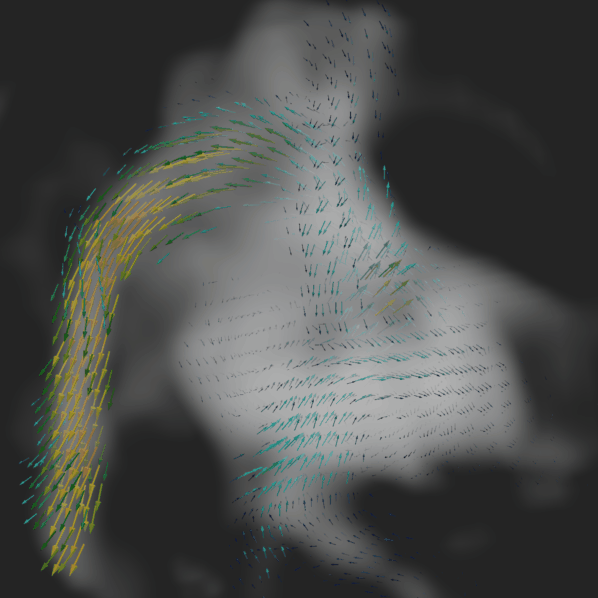
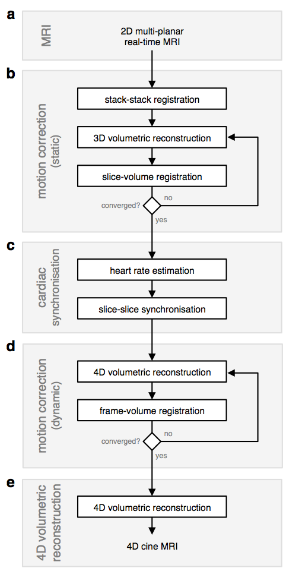

# fetal_cmr_4d

fetal whole-heart 4D magnitude and flow cine reconstruction using multiple real-time non-coplanar balanced SSFP stacks

  

## Publications

__Fetal whole-heart 4D flow cine MRI using multiple non-coplanar balanced SSFP stacks__  
Thomas A. Roberts, Joshua FP van Amerom, Alena Uus, David FA Lloyd, Anthony N. Price, Jacques-Donald  Tournier, Laurence H. Jackson, Shaihan J Malik, Milou PM van Poppel, Kuberan Pushparajah, Mary A Rutherford, Reza Rezavi, Maria Deprez, Joseph V. Hajnal.
13 May 2019. bioRxiv: [10.1101/635797](https://doi.org/10.1101/635797) (_preprint_) 

__Fetal whole-heart 4D imaging using motion-corrected multi-planar real-time MRI__  
Joshua FP van Amerom, David FA Lloyd, Maria Deprez, Anthony N Price, Shaihan J Malik, Kuberan Pushparajah, Milou PM van Poppel, Mary A Rutherford, Reza Razavi, Joseph V Hajnal.  
13 Apr 2019. Magnetic Resonance in Medicine. 2019. doi: [10.1002/mrm.27798](https://doi.org/10.1002/mrm.27798) (_accepted, peer-reviewed+revised_)  
05 Dec 2018. arXiv: [1812.02249](https://arxiv.org/abs/1812.02249) (_preprint_)  

## Directories

__4dflow__ - preprocessing and postprocessing scripts for flow reconstruction  

__4drecon__ - preprocessing and 4D reconstruction scripts  

__SVRTK__ - 4D reconstruction submodule linked to [github.com/SVRTK/SVRTK](https://github.com/SVRTK/SVRTK)

__cardsync__ - cardiac synchronisation   

__eval__ - summarise and evaluate results

__ktrecon__ - k-t sense reconstruction submodule linked to [github.com/mriphysics/ktrecon](https://github.com/mriphysics/ktrecon)

__paraview__ - visualisation of 4D flow volumes

__synthflow_phantom__ - simulated flow phantom and 2D velocity-encoded slice acquisition submodule linked to [github.com/tomaroberts/synthflow_phantom](github.com/tomaroberts/synthflow_phantom)


## Installation

Add repository to MATLAB path.

Build instructions for SVRTK can be found in the InstallationInstructions.txt file at [github.com/SVRTK/SVRTK](https://github.com/SVRTK/SVRTK).

Install MITK Workbench for viewing data and drawing masks: [mitk.org/wiki/The_Medical_Imaging_Interaction_Toolkit_(MITK)](http://mitk.org/wiki/The_Medical_Imaging_Interaction_Toolkit_(MITK)). Note, 2016.11 version is known to be stable.

For Python code, install [Jupyter](https://jupyter.org/) or [PyCharm](https://www.jetbrains.com/pycharm/).

Install Paraview for visualisation of 4D flow volumes: [paraview.org](https://www.paraview.org/). Note, version 5.4.1 is known to be stable.

Installation time varies depending on how many libraries and programs you already have installed. Typically everything can be installed in less than one hour.


## External Dependencies

__ReconFrame__ - software platform providing the tools and the functionality to develop and execute a complete image reconstruction of Philips MR data ([gyrotools.com/gt/index.php/products/reconframe](https://www.gyrotools.com/gt/index.php/products/reconframe))


## Demo Dataset

A demo dataset can be [downloaded from Figshare](https://figshare.com/collections/Demo_dataset_for_fetal_whole-heart_4D_reconstruction/4689437). 

The demo dataset consists of multiple stacks of 2D slices acquired in a normal fetus. A Matlab script is included alongside the demo dataset, which follows the 4D reconstruction framework outlined below. The script comprises various Matlab functions and tells the user when to run the bash scripts.

The expected run time for the demo, from slices to 4D volumes, is 6+ hours depending on computer power and familiarity with the concepts and scripts.

Note: the nifti files provided in the demo dataset have been reconstructed using the ktrecon submodule, which requires ReconFrame. Similarly, we provide the gradient first moment text files, which we would normally automatically generate using ReconFrame.

## Framework 

This framework produces 4D magnitude and velocity cine volumes. The framework consists of:

**PART 0 (2D MRI Acquisition and k-t SENSE Reconstruction):**
1. multiple stacks of real-time non-coplanar 2D bSSFP slices are acquired using a 1.5T MRI scanner and reconstructed offline using ReconFrame.

**PART 1 (Anatomical Reconstruction):**
1. an initial motion correction stage to achieve rough spatial alignment of the fetal heart using temporal mean (i.e., static) images for stack-stack registration followed by slice-volume registration interleaved with static volume (3D) reconstruction; 
2. cardiac synchronisation, including heart rate estimation and slice-slice cardiac cycle alignment; and 
3. further motion-correction using dynamic image frames interleaved with 4D reconstruction; and 
4. 4D magnitude cine volume reconstruction, including outlier rejection.

**PART 2 (Flow Reconstruction):**

5. background phase correction of phase images;
6. gradient first moment reorientation to account for motion with respect to the velocity-encoding gradients;
7. 4D velocity cine volume reconstruction; and
8. background drift correction of 4D velocity volumes.

  

## Reconstruction Steps

The reconstruction process is performed using a combination of Matlab and bash scripts which call various C++ functions in the SVRTK toolbox. A final step using Python is performed to automate visualisation of the 4D flow volumes in Paraview, however, this is optional as the .vtk files can be manually loaded into Paraview.

### Part 0 — Directory setup and MRI

Note: if using the demo dataset, Part 0 can be skipped.

1. __Setup__  \
create working directories,  \
e.g., in shell:  
	```shell 
	RECONDIR=~/path/to/recon/directory
	mkdir $RECONDIR
	mkdir $RECONDIR/data
	mkdir $RECONDIR/ktrecon
	mkdir $RECONDIR/mask
	mkdir $RECONDIR/cardsync
	```
	If using the demo dataset, then:
	```shell
	RECONDIR=~/fetal_cmr_4drecon_demo/tutorial_data
	```

2. __MRI__
    - acquire 2D multiple non-coplanar real-time MRI stacks of 2D data
    - reconstruct images using `ktrecon`,
    e.g., for each stack, in Matlab:
        ```matlab
        reconDirPath        = '~/path/to/recon/directory';
        seriesNo            = 0;
        rawDataFilePath     = '~/path/to/rawdata.lab';
        senseRefFilePath    = '~/path/to/senserefscan.lab';
        coilSurveyFilePath  = '~/path/to/coilsurveyscan.lab';
        outputDirPath       = fullfile( reconDirPath, 'ktrecon' );
        outputStr           = sprintf( 's%02i', seriesNo );
        reconOpts           = { 'GeometryCorrection', 'Yes' };

        mrecon_kt(   rawDataFilePath, ...
                    'senseref', senseRefFilePath, ...
                    'coilsurvey', coilSurveyFilePath, ...
                    'outputdir', outputDirPath, ...
                    'outputname', outputStr, ...
                    'patchversion', patchVersion,...
                    'reconoptionpairs', reconOpts )
        ```
    - further processsing
        - copy/move all magnitude-valued DC (s\*_dc_ab.nii.gz) and real-time (s\*_rlt_ab.nii.gz) files from 'ktrecon' directory to 'data' directory \
        e.g., in shell: 
            ```shell
            cp ktrecon/s*_dc_ab.nii.gz data;
            cp ktrecon/s*_rlt_ab.nii.gz data;
            ```

### Part 1 — 4D Magnitude CINE volume reconstruction

3. __Draw Fetal Heart Masks__
      - manually draw fetal heart masks for each `sXX_dc_ab.nii.gz` file (e.g., using the [Medical Imaging ToolKit (MITK) Workbench](http://mitk.org/wiki/Downloads#MITK_Workbench))
          - draw ROI containing fetal heart and great vessels for each slice
          - save segmentation as `sXX_mask_heart.nii.gz` segmentation in 'mask' directory

4. __Preprocessing__            
      - run `preproc` in Matlab,
          ```matlab
          reconDir = '~/path/to/recon/directory';
          S = preproc( reconDir );
          save( fullfile( reconDir, 'data', 'results.mat' ), 'S', '-v7.3' );
          ```
      - optionally, manually specify
          - target stack by changing value in 'data/tgt_stack_no.txt' (stacks are index 1,2,...)
          - excluded stacks/slices/frames by specifying in 'data/force_exclude_*.txt' (stacks/slices/frames are zero-indexed)
5. __Motion-Correction (static)__
    - create 3D mask of fetal chest
        - recon reference volume, \
        e.g., in shell: 
        ```shell
        RECONDIR=~/path/to/recon/directory
        ./recon_ref_vol.bash $RECONDIR ref_vol
        ```

6. __Draw Fetal Chest Mask__
      - draw fetal chest ROI using 'ref_vol.nii.gz' as a reference (e.g., using MITK)
      - save segmentation to 'mask' directory as  'mask_chest.nii.gz'
          - _note:_ the orientation of all later 3D/4D reconstructions is determined by this mask file; the orientation can be changed by applying a transformation to 'mask_chest.nii.gz' prior to further reconstructions

7. __Motion-Correction (static), continued__
	  - static (slice-wise) motion-correction, \
    e.g., in shell: 
        ```shell
        RECONDIR=~/path/to/recon/directory˜
        ./recon_dc_vol.bash $RECONDIR dc_vol
        ```
8. __Cardiac Intraslice Synchronisation__
    - heart-rate estimation
        - run `cardsync_intraslice`, in Matlab:
            ```matlab
            reconDir    = '~/path/to/recon/directory';
            dataDir     = fullfile( reconDir, 'data' );
            cardsyncDir = fullfile( reconDir, 'cardsync' );
            M = matfile( fullfile( dataDir, 'results.mat' ) );
            S = cardsync_intraslice( M.S, 'resultsDir', cardsyncDir, 'verbose', true );
            ```
9. __Reconstruct Slice Cine Volumes__
        - recon cine volume for each slice, \
        e.g., in shell: 
            ```shell
            RECONDIR=~/path/to/recon/directory
            ./recon_slice_cine.bash $RECONDIR
            ```
        - optionally, specify target slice by creating file 'data/tgt_slice_no.txt' containing target slice number (indexed starting at 1)

10. __Cardiac Interslice Synchronisation__
	- run `cardsync_interslice`, in Matlab:
		```matlab
		% setup
		reconDir    = '~/path/to/recon/directory';
		dataDir     = fullfile( reconDir, 'data' );
		cardsyncDir = fullfile( reconDir, 'cardsync' );
		cineDir     = fullfile( reconDir, 'slice_cine_vol' );    
		M = matfile( fullfile( cardsyncDir, 'results_cardsync_intraslice.mat' ) );

		% target slice
		tgtLoc = NaN;
		tgtLocFile = fullfile( dataDir, 'tgt_slice_no.txt' );
		if exist( tgtLocFile , 'file' )
		  fid = fopen( tgtLocFile, 'r' );
		  tgtLoc = fscanf( fid, '%f' );
		  fclose( fid );
		end

		% excluded slices
		excludeSlice = [];
		excludeSliceFile = fullfile( dataDir, 'force_exclude_slice.txt' );
		if exist( excludeSliceFile , 'file' )
		  fid = fopen( excludeSliceFile, 'r' );
		  excludeSlice = fscanf( fid, '%f' ) + 1;  % NOTE: slice locations in input file are zero-indexed
		  fclose( fid );
		end

		% slice-slice cardiac synchronisation
		S = cardsync_interslice( M.S, 'recondir', cineDir, 'resultsdir', cardsyncDir, 'tgtloc', tgtLoc, 'excludeloc', excludeSlice );
		```
11. __Motion-Correction (dynamic) & 4D Volumetric Reconstruction__
    - motion correction performed interleaved with 4D Reconstruction
    - recon 4D magnitude volume, \
	    e.g., in shell: 
	    ```shell
	    RECONDIR=~/path/to/recon/directory
	    ./recon_cine_vol.bash $RECONDIR cine_vol
	    ```

12. __Motion-Correction (dynamic) & 4D Magnitude Volumetric Reconstruction__  \
		e.g., in Matlab:  
		```matlab
		S = summarise_recon( '~/path/to/recon/directory/cine_vol', '~/path/to/recon/directory/cardsync', 'verbose', true );
		I = plot_info( '~/path/to/recon/directory/cine_vol/info.tsv');
		```

### Part 2 — 4D Velocity CINE volume reconstruction
13. __Draw Uterus Masks__
        - manually draw uterus masks for each `sXX_dc_ab.nii.gz` file (e.g., using the [Medical Imaging ToolKit (MITK) Workbench](http://mitk.org/wiki/Downloads#MITK_Workbench))
            - save segmentation as `sXX_mask_uterus.nii.gz` segmentation in 'mask' directory

14. __Background Phase Correction__
    - generate phase corrected stacks by subtraction of 3D polynomial
        - run `fcmr_4dflow_preprocessing`, in Matlab:
            ```matlab
			cd(reconDir);
			fcmr_4dflow_preprocessing( reconDir );
			disp('fcmr_4dflow_preprocessing complete ...');
            ```

15. __Extract Gradient First Moments__
    - generate text files containing gradient first moment information for each stack
        - run `fcmr_4dflow_get_first_moments`, in Matlab:
            ```matlab
			cd(reconDir);
			fcmr_4dflow_get_first_moments( reconDir );
			disp('fcmr_4dflow_get_first_moments complete ...');
            ```
16. __Gradient First Moment Reorientation & 4D Velocity Volumetric Reconstruction__
    - gradient first moment reorientation performed as part of 4D reconstruction
    - recon 4D velocity volume, \
	    e.g., in shell: 
	    ```shell
	    RECONDIR=~/path/to/recon/directory
	    ./recon_vel_vol.bash $RECONDIR vel_vol
	    ```
17. __Background Drift Correction__
    - background velocity drift correction
    - recon 4D velocity volume, \
        - run `fcmr_4dflow_postprocessing`, in Matlab:
            ```matlab
			cd(reconDir);
			fcmr_4dflow_postprocessing( reconDir, 'useVelDriftCorr', true, 'fileExt', 'polyCorr' );
			disp('fcmr_4dflow_postprocessing complete ...');
            ```

### Part 3 — Whole-heart 4D Blood Flow Visualisation
18. __Create 4D Volumes for Paraview__
    - Edit the fields of fcmr_4dflow_make_vector_vol.py to point at `RECONDIR`,
        - run `fcmr_4dflow_make_vector_vol.py`
    - Note: this is an optional step to automate the process of importing the data into Paraview
	    - alternatively, the `.vtk` files located in `/vel_vol_4d/paraview` can be loaded from within Paraview
18. __View 4D Blood Flow Volume in Paraview__
    - In Paraview,
	    - `File > Load State`
	    - Navigate to `/vel_vol_4d/paraview`
	    - Open `fcmr*_paraview.pvsm`
 
